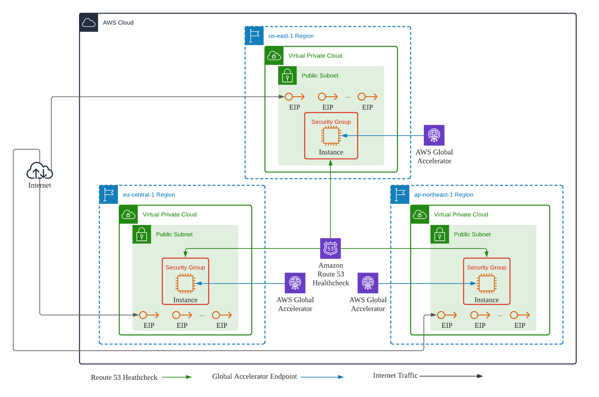

# AWS Global Accelerator Client IP Preservation for EC2 Instance


## Preparation
Rename `terraform.tfvars.template` to `terraform.tfvars`
```shell
mv terraform.tfvars.template terraform.tfvars
```
Edit `terraform.tfvars` and configure the `instance_type` and `network_interface_count` accordingly

## Stack Provisioning
```shell
terraform init
terraform plan
terraform apply
```

## Outputs
1. Get the Global Accelerator IP addresses
```shell
terraform output aga
```
   
## Teardown
```shell
terraform destroy
```
